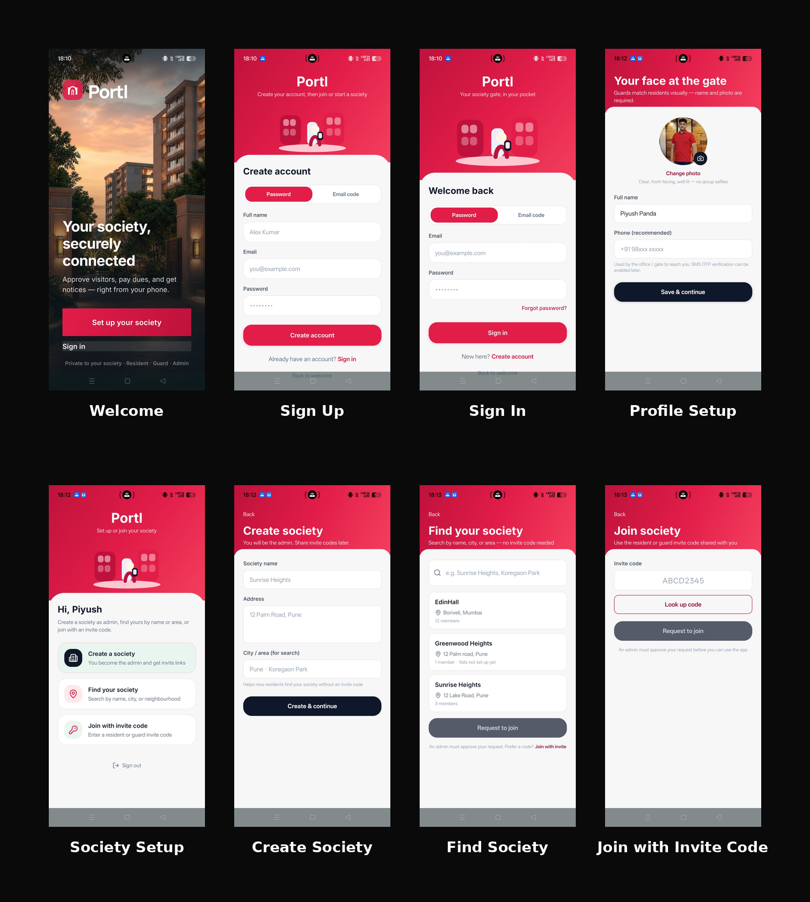
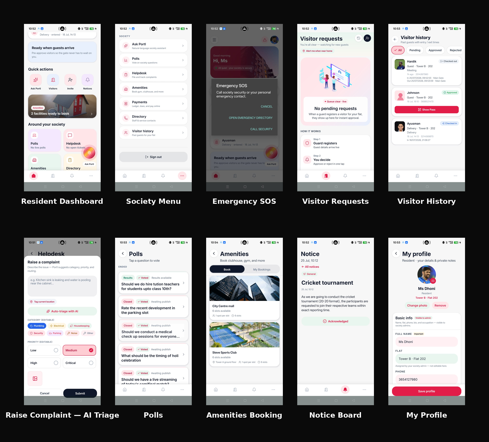
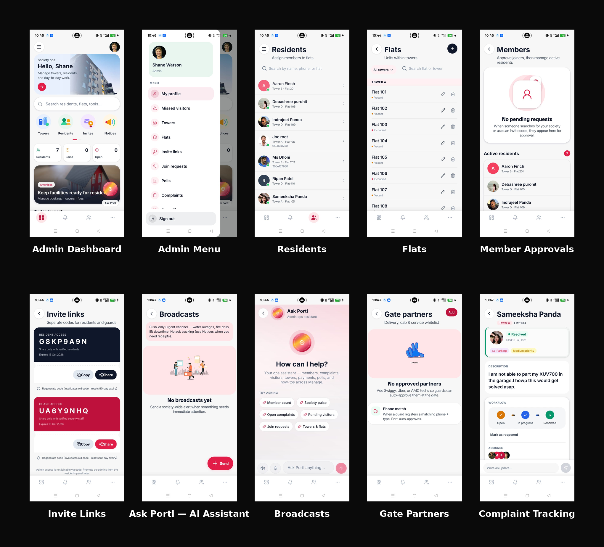
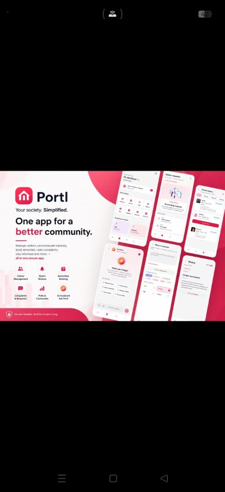
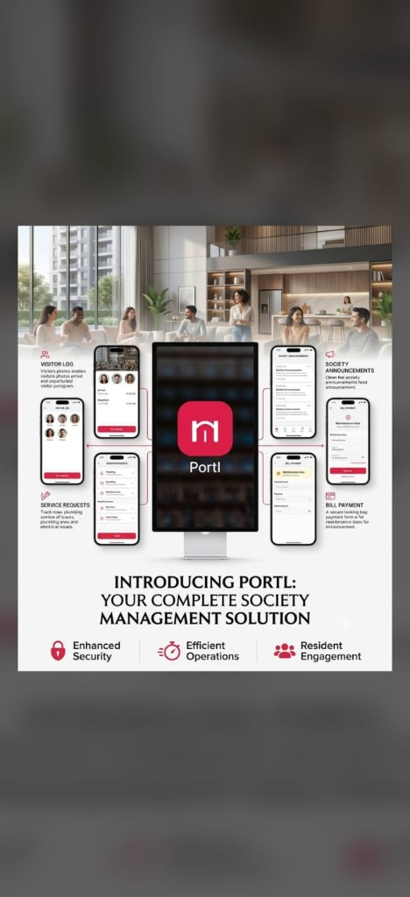

# Portl — Society Management App

> One app for the gate, the residents, and the society office.

Portl replaces WhatsApp groups, paper visitor registers, and scattered admin work with a single mobile experience. Residents approve visitors, guards run the gate, and admins run the society — each in a role-specific dashboard backed by the same live data.

```text
  Resident  ←→  real-time approvals / notices / dues  ←→  Admin
      ↑                                                      ↑
      └────────────── Guard at the gate ─────────────────────┘
```

| | |
|:--|:--|
| **Platform** | Expo + React Native (Android / iOS) |
| **Backend** | Supabase (Auth, Postgres, Realtime, Storage, Edge Functions) |
| **Auth** | Password + email OTP (6-digit code) |
| **Payments** | Razorpay (maintenance dues & fines) |

---

## Table of contents

1. [Judge demo — sign in here first](#-judge-demo--sign-in-here-first)
2. [Video walkthroughs](#-video-walkthroughs)
3. [What is Portl?](#what-is-portl)
4. [How the product works](#how-the-product-works)
5. [App screens](#app-screens)
6. [Features by role](#features-by-role)
7. [Authentication explained](#authentication-explained)
8. [Tech stack](#tech-stack)
9. [Project structure](#project-structure)
10. [Prerequisites](#prerequisites)
11. [Getting started](#getting-started)
12. [Scripts & quality checks](#scripts--quality-checks)
13. [License](#license)

---

## 🔐 Judge demo — sign in here first

**Evaluating Portl?** Start here. These accounts share **one society** — no signup, no invite code, no waiting for email.

### 1. Install the preview APK

| Link | Use this for |
|:-----|:-------------|
| **[⬇ Download Portl APK](https://expo.dev/artifacts/eas/QNwbRYIBLyWgeJFiDwEyjvJfZkI5F8BuIUf9ZMGliUo.apk)** | **Install the app** — direct `.apk` file (recommended for judges) |
| [Expo build details](https://expo.dev/accounts/ayushpandas-team/projects/portl/builds/ee7d467e-1eeb-480d-b41d-0d3ae9b613aa) | Build status / logs / metadata (may require an Expo account; not needed to install) |

1. Tap **Download Portl APK**.
2. Open the downloaded file and install (allow unknown sources if Android asks).
3. Open **Portl**.

> Prefer the **APK download** link. The Expo build page is optional and can show an “internal distribution” message if you’re not logged into Expo — the APK still works.

### 2. Sign in with a demo account

> **Sign in path:** App → **Sign in** → **Password** tab → use email + password below  
> Do **not** use the Email code tab for these demo accounts.

| Role | What you can explore | Email | Password | Watch |
|:-----|:---------------------|:------|:---------|:------|
| 🏛️ **Society admin** | Residents, flats, notices, complaints, dues, partners, Ask Portl | `shanwwatson@gmail.com` | `SHANEwatson` | [▶ Short](https://youtube.com/shorts/RMtny4l16lA) |
| 🏠 **Resident** | Visitors, SOS, helpdesk, polls, amenities, payments, notices | `msdhoni@gmail.com` | `MSdhoni` | [▶ Short](https://youtube.com/shorts/wAsG4K9PFVI) |
| 🛂 **Security (guard)** | Register visitors, QR scan, verify status, visitor log | `honeysingh@gmail.com` | `HONEYsingh` | [▶ Short](https://youtube.com/shorts/VQ7azUFgBu8) |

### Suggested 5-minute walkthrough

1. Install the [preview APK](https://expo.dev/artifacts/eas/QNwbRYIBLyWgeJFiDwEyjvJfZkI5F8BuIUf9ZMGliUo.apk).
2. Watch the matching [video short](#-video-walkthroughs) (optional, ~1 min each).
3. **Admin** (`shanwwatson@gmail.com`) — open the society dashboard, notices, residents, and dues.
4. **Sign out** → **Resident** (`msdhoni@gmail.com`) — check visitors, notices, amenities, and payments.
5. **Sign out** → **Guard** (`honeysingh@gmail.com`) — register a visitor and follow approval / entry flow.

> **Why password demos?** Judges need instant access. Email OTP is also built in (see [Authentication explained](#authentication-explained)); for live evaluation, password accounts above are the reliable path.

---

## 🎬 Video walkthroughs

Prefer watching before tapping? These YouTube Shorts show the live app for each role. Use the **same demo accounts** as above, then follow along in the APK.

| Role | What the short covers | Open video |
|:-----|:----------------------|:-----------|
| 🏛️ **Society admin** | Sign in as admin and tour society operations | [Watch admin walkthrough](https://youtube.com/shorts/RMtny4l16lA) |
| 🛂 **Security (guard)** | Gate workflows — register, verify, visitor flow | [Watch guard walkthrough](https://youtube.com/shorts/VQ7azUFgBu8) |
| 🏠 **Resident** | Resident home — visitors, notices, everyday tools | [Watch resident walkthrough](https://youtube.com/shorts/wAsG4K9PFVI) |

### How to use the videos with the app

1. Install the [preview APK](https://expo.dev/artifacts/eas/QNwbRYIBLyWgeJFiDwEyjvJfZkI5F8BuIUf9ZMGliUo.apk) and open Portl.
2. Go to **Sign in** → **Password** tab.
3. Pick a role from the [demo table](#-judge-demo--sign-in-here-first).
4. Play the matching short in another window, then mirror the same taps in the app.

**Quick links**

- Admin → [youtube.com/shorts/RMtny4l16lA](https://youtube.com/shorts/RMtny4l16lA)
- Guard → [youtube.com/shorts/VQ7azUFgBu8](https://youtube.com/shorts/VQ7azUFgBu8)
- Resident → [youtube.com/shorts/wAsG4K9PFVI](https://youtube.com/shorts/wAsG4K9PFVI)

---

## What is Portl?

Apartment societies still run on phone calls, WhatsApp forwards, and notebooks at the gate. That creates missed approvals, unclear dues, and no single source of truth.

**Portl** is a role-based society OS:

| Problem today | What Portl does |
|:--------------|:----------------|
| Guard calls the flat for every visitor | In-app approve / reject / pre-approve with live status |
| Notices buried in chat groups | Pinable notice board with audience targeting |
| Paper complaint registers | Helpdesk with photos, priority, and comment threads |
| Cash / unclear maintenance dues | In-app dues & fines via Razorpay |
| No shared admin tools | Admin console for towers, flats, invites, staff, partners |

New users either **create a society** (become admin) or **join with an invite code**. After that, RLS (row-level security) keeps each society’s data isolated.

---

## How the product works

```text
┌─────────────┐     ┌──────────────────┐     ┌─────────────┐
│  Resident   │     │   Supabase       │     │    Guard    │
│  app        │◄───►│  Auth · DB · RT  │◄───►│    app      │
└─────────────┘     │  Storage · Fns   │     └─────────────┘
                    └────────┬─────────┘
                             │
                    ┌────────▼─────────┐
                    │  Admin / office  │
                    └──────────────────┘
```

1. **Auth** — user signs in (password or email OTP). Profile stores `role`: `resident` | `guard` | `admin`.
2. **Society** — user is linked to a society (create, join, or seeded demo).
3. **Routing** — app opens the matching dashboard (resident / guard / admin).
4. **Realtime** — visitors, notices, and complaints update live across roles.
5. **Push** — Edge Functions deliver approval / notice / escalation notifications.

---

## App screens

### 1. Onboarding

Welcome → sign up / sign in → profile → create or join a society.



### 2. Resident

Home, visitors, SOS, complaints, polls, amenities, notices, payments, and profile.



### 3. Admin

Society ops: residents, flats, invites, broadcasts, Ask Portl, gate partners, complaints, dues.



### Branding

Product overview creatives for Portl — what the app covers at a glance.





---

## Features by role

### Residents

- Approve, reject (with reason), or **pre-approve** visitors (with expiry windows)
- Live visitor history and status
- Helpdesk complaints — photos, priority, comment threads
- Society notice board
- Community polls
- Amenity booking with live slot availability
- Staff & service provider directory (Services)
- Pay maintenance dues and fines (Razorpay)
- Committee members can open granted admin tools from **More**

### Security guards

- Register visitors at the gate
- Search residents by name or flat and raise approval requests
- Auto-approve whitelisted delivery / cab / service partners
- Scan QR passes for pre-approved visitors (strict expiry)
- Verify approval status in real time
- Mark entry and exit
- Full visitor log — flags, notes, CSV export

### Society admins

- Manage towers, flats, and residents
- Approve join requests and generate invite codes
- Staff & service providers (shifts, categories)
- Notices — audience targeting, pinning, cover images
- Polls and complaint resolution
- Amenities and booking slots
- Maintenance dues and gate partner whitelist
- **Ask Portl** — AI assistant for society operations

### Platform-wide

- Role-based access (resident / guard / admin), each with its own UI
- Realtime sync for visitors, notices, complaints
- Push notifications for approvals, notices, and escalations
- Create society or join via invite code
- Dark mode
- Optional Sentry crash reporting via env

---

## Authentication explained

Portl uses **Supabase Auth**. Two sign-in methods share the same user account if the email matches.

| Method | How it works | Best for |
|:-------|:-------------|:---------|
| **Password** | Email + password via `signUp` / `signInWithPassword` | Judges, demos, everyday login |
| **Email code (OTP)** | App calls `signInWithOtp` → inbox gets a **6-digit code** → `verifyOtp` | Passwordless / production-style login |

```text
Password path
  email + password  →  session  →  load profile  →  role dashboard

Email code path
  email  →  Supabase emails OTP  →  enter 6 digits  →  session  →  same profile routing
```

**After either method succeeds**, Portl loads `profiles` (role, name, society) and routes to the correct home.

| Topic | Detail |
|:------|:-------|
| Roles | `resident`, `guard`, `admin` on `profiles` (+ optional committee permissions) |
| Data isolation | Postgres **RLS** scopes rows to the signed-in user’s society |
| Forgot password | Login → **Forgot password?** → email link → set a new password |
| Email OTP setup | Requires custom SMTP (e.g. Resend) and a Magic Link / OTP template that includes `{{ .Token }}` |
| Demo accounts | Prefer **Password** tab — see [Judge demo](#-judge-demo--sign-in-here-first) |

---

## Tech stack

| Layer | Technology |
|:------|:-----------|
| App framework | [Expo](https://expo.dev) + [React Native](https://reactnative.dev) |
| Navigation | Expo Router (file-based) |
| Language | TypeScript |
| Styling | NativeWind (Tailwind for React Native) |
| Client state | Zustand |
| Server state | TanStack Query |
| Backend | [Supabase](https://supabase.com) — Postgres, Auth, Realtime, Storage, Edge Functions |
| Payments | Razorpay |
| Push | Expo Notifications + Supabase Edge Functions |
| QA | Jest, Maestro, pgTAP (RLS / schema) |
| CI/CD | GitHub Actions |
| Motion | Moti, Lottie, Reanimated |

---

## Project structure

```text
portl/
├── src/
│   ├── app/                 # Expo Router screens
│   │   ├── (auth)/          # Login, signup, verify-email, callback
│   │   ├── (onboarding)/    # Create / join society
│   │   ├── (admin)/         # Admin dashboards
│   │   ├── (guard)/         # Gate workflows
│   │   ├── (resident)/      # Resident experience
│   │   └── (platform)/      # Platform admin console
│   ├── components/          # Shared + feature UI
│   ├── constants/           # Theme, colors, config
│   ├── hooks/               # Custom React hooks
│   ├── lib/                 # Supabase client, auth helpers, routing
│   ├── stores/              # Zustand (auth, app state)
│   ├── theme/               # Design tokens
│   └── types/               # Shared TypeScript types
├── supabase/
│   ├── migrations/          # Schema, RLS, storage
│   ├── functions/           # Edge Functions (push, payments, Ask Portl, …)
│   ├── tests/               # pgTAP RLS / schema checks
│   └── seed_demo.sql        # Optional demo seed
├── __tests__/               # Jest unit + RTL tests
├── .maestro/                # E2E smoke / login flows
├── docs/screenshots/        # App flow screenshots
└── .github/workflows/       # Lint, typecheck, test
```

---

## Prerequisites

- [Node.js](https://nodejs.org) **20+** and npm
- A [Supabase](https://supabase.com) project (free tier is fine)
- Android device/emulator or iOS simulator with a **development build**  
  (`npx expo run:android` / `run:ios`)  
  **Expo Go is not enough** for Razorpay, camera, or NetInfo
- Optional: [Supabase CLI](https://supabase.com/docs/guides/cli) for migrations, functions, and `npm run test:db`

---

## Getting started

### 1. Clone and install

```bash
git clone https://github.com/Ayush-Panda-design/PORTL-Society-Management-App.git
cd PORTL-Society-Management-App
npm install
```

### 2. Set up Supabase

1. Create a project at [supabase.com](https://supabase.com).
2. Apply migrations (`supabase/migrations/` in order), either in the SQL Editor or:

   ```bash
   supabase link --project-ref your-project-ref
   supabase db push
   ```

3. Copy **Project URL** and **anon/public key** from **Project Settings → API**.

### 3. Environment variables

```bash
cp .env.example .env
```

Minimum for the app:

```env
EXPO_PUBLIC_SUPABASE_URL=https://your-project.supabase.co
EXPO_PUBLIC_SUPABASE_ANON_KEY=your-anon-key-here
```

Optional (see `.env.example` for full notes):

- `EXPO_PUBLIC_RAZORPAY_KEY_ID` — payments checkout
- `EXPO_PUBLIC_AUTH_REDIRECT_URL` — email link / OTP deep links in Expo Go
- `EXPO_PUBLIC_SENTRY_DSN` — crash reporting
- Server secrets (`RAZORPAY_*`, `GEMINI_API_KEY`, …) via `supabase secrets set` — **not** in the client `.env`

### 4. Run (development build)

```bash
npx expo run:android
# or
npx expo run:ios
```

If Metro isn’t already running:

```bash
npx expo start --dev-client
```

For judge submissions, prefer an **EAS preview APK**:

```bash
eas build -p android --profile preview
```

Current preview for evaluators:

| Link | Purpose |
|:-----|:--------|
| [Download Portl APK](https://expo.dev/artifacts/eas/QNwbRYIBLyWgeJFiDwEyjvJfZkI5F8BuIUf9ZMGliUo.apk) | Install the app |
| [Expo build details](https://expo.dev/accounts/ayushpandas-team/projects/portl/builds/ee7d467e-1eeb-480d-b41d-0d3ae9b613aa) | Build metadata (optional) |

Demo credentials are at the [top of this README](#-judge-demo--sign-in-here-first).

### 5. Edge Functions (optional but needed for push / payments / Ask Portl)

```bash
supabase functions deploy send-push
supabase functions deploy dispatch-push-outbox
# Schedule dispatch-push-outbox every 1–2 minutes (Dashboard Cron or pg_net)
# Auth: Authorization: Bearer <SERVICE_ROLE_KEY>  or  x-cron-secret: <CRON_SECRET>
```

---

## Scripts & quality checks

| Command | Description |
|:--------|:------------|
| `npm start` | Expo dev server (dev client) |
| `npm run android` / `npm run ios` | Build & run native app |
| `npm test` | Jest unit + RTL tests |
| `npm run typecheck` | TypeScript (app) |
| `npm run typecheck:functions` | Deno check for Edge Functions |
| `npm run lint` | ESLint (app + functions) |
| `npm run test:db` | pgTAP: schema, privileges, RLS presence |
| `maestro test .maestro/` | E2E smoke + login (dev/preview build) |

---

## License

This project is provided as-is for personal and educational use.
